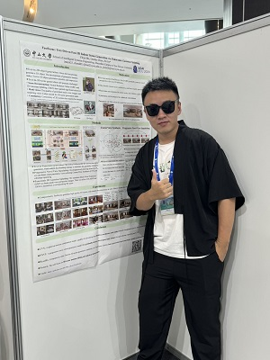

# About Me

Here is **Yikun Ma (马义坤)**.

  - I am pursuing a master degree in the School of Intelligent Systems Engineering, Shenzhen Campus of Sun Yat-sen University.
  - 🧪 Member of the [FVL](https://fvl2020.github.io/fvl.github.com/) 
  - 🔬 **Research Intern** @ [Tencent AIPD] (Jun – Sep 2025)  
  Working on **LLM Agents for 3D Game** — enabling language-driven reasoning, coding generation in 3D scenes. 
  - 🎯 Actively seeking full-time opportunities in **Generative 3D AI / LLM Agents / Computer Vision** (Fall 2025)
## Research Interests

- 3D Computer Vision
- 3D AIGC
- Low-level Vision
- Diffusion Models

## Main Papers

- **Yikun Ma**, Yiqing Li, Jiawei Wu, Zhi Jin*.
  MotionDiff: Training-free Zero-shot Interactive Motion Editing via Flow-assisted Multi-view Diffusion.
 (**ICCV-25**).

- **Yikun Ma**, Dandan Zhan, Zhi Jin*. 
  FastScene: Text-Driven Fast 3D Indoor Scene Generation via Panoramic Gaussian Splatting.
  Proceedings of the Thirty-Third International Joint Conference on Artificial Intelligence **(IJCAI-24)**.

- **Yikun Ma**, Haoran Qi, Zhi Jin*.
  Eliminating Moire Patterns Across Diverse Image Resolutions via DMMNet.
  IEEE TRANSACTIONS ON MULTIMEDIA (**TMM-25**).

- Yiqing Li, Xuan Wang, Jiawei Wu, **Yikun Ma**, Zhi Jin.
  SparseGS-W: Sparse-View 3D Gaussian Splatting in the Wild with Generative Priors. **TCSVT-2026**

